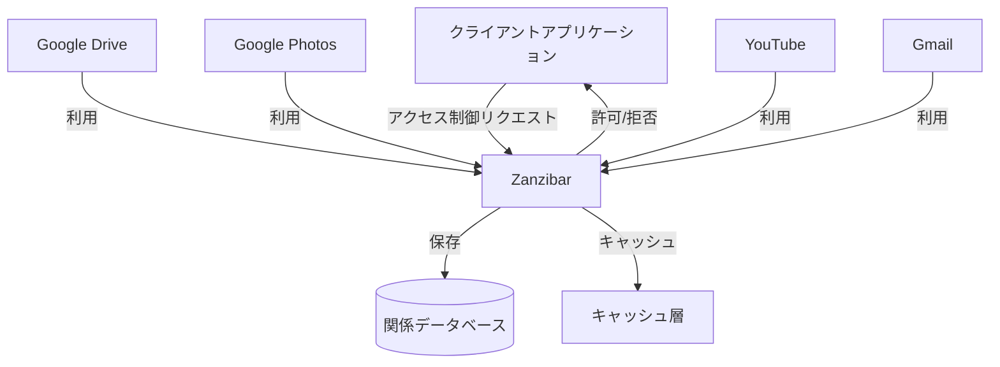
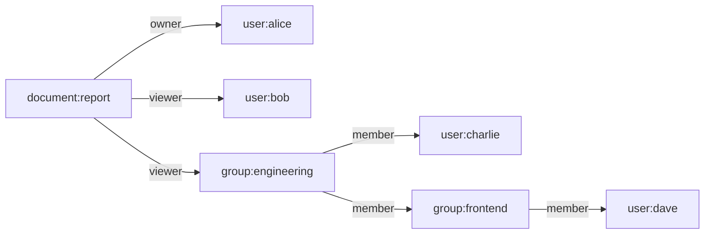
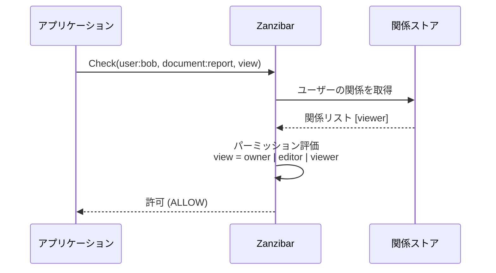
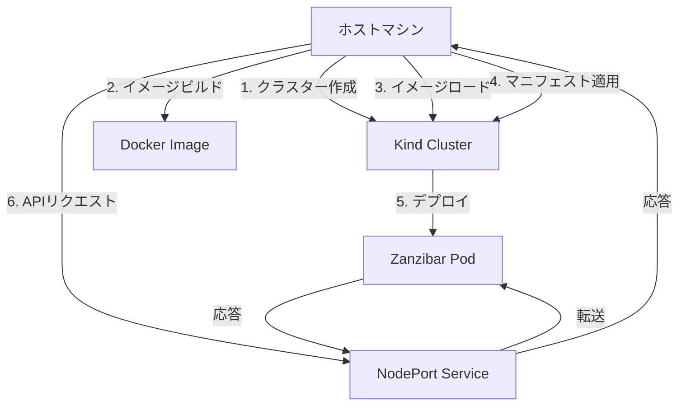

# Zanzibar

- [Zanzibar](#zanzibar)
  - [概要](#概要)
  - [主な特徴](#主な特徴)
  - [基本概念](#基本概念)
    - [名前空間とオブジェクト](#名前空間とオブジェクト)
    - [関係（リレーション）](#関係リレーション)
    - [アクセス制御リスト（ACL）](#アクセス制御リストacl)
    - [許可（パーミッション）](#許可パーミッション)
    - [関係のツリー（Relation Tuples）](#関係のツリーrelation-tuples)
    - [認可フロー](#認可フロー)
  - [Kindを使った動作確認方法](#kindを使った動作確認方法)
    - [前提条件](#前提条件)
    - [1. Kindクラスターの作成](#1-kindクラスターの作成)
    - [2. Zanzibarアプリケーションのビルドとロード](#2-zanzibarアプリケーションのビルドとロード)
    - [3. Kubernetesマニフェストの作成](#3-kubernetesマニフェストの作成)
    - [4. アプリケーションのデプロイ](#4-アプリケーションのデプロイ)
    - [5. アプリケーションのテスト](#5-アプリケーションのテスト)
    - [6. クリーンアップ](#6-クリーンアップ)
  - [API エンドポイント](#api-エンドポイント)
  - [仕様適合性](#仕様適合性)
  - [参考資料](#参考資料)

## 概要

Zanzibarは、Googleが開発した大規模分散アクセス制御システムです。2019年に論文として発表され、Google DriveやGoogle Photos、YouTube、Gmailなど、Googleの多くのサービスで使用されています。Zanzibarは数兆のアクセス制御関係を管理し、毎秒数百万のアクセス制御決定を処理する能力を持っています。



## 主な特徴

- **関係ベースのアクセス制御（ReBAC）**: ユーザーとリソース間の関係性に基づいてアクセス制御を行います
- **一貫性のある分散システム**: グローバルに分散したシステムでも一貫性のあるアクセス制御を提供します
- **低レイテンシ**: ミリ秒単位の応答時間でアクセス制御の判断を行います
- **スケーラビリティ**: 数十億のユーザーと数兆のアクセス関係を処理できます
- **柔軟性**: 様々なアクセス制御モデルをサポートします

## 基本概念

### 名前空間とオブジェクト

Zanzibarでは、すべてのリソースは「名前空間」に属し、各リソースは一意の「オブジェクトID」を持ちます。例えば：

- `document:report` - `document`名前空間内の`report`というIDを持つオブジェクト
- `user:alice` - `user`名前空間内の`alice`というIDを持つオブジェクト

### 関係（リレーション）

オブジェクト間の関係は「リレーション」として定義されます。例えば：

- `document:report#owner@user:alice` - ユーザーAliceはドキュメントreportの所有者である
- `document:report#viewer@user:bob` - ユーザーBobはドキュメントreportの閲覧者である



### アクセス制御リスト（ACL）

各オブジェクトは、そのオブジェクトに対する操作を許可するユーザーやグループを定義するACLを持ちます。

### 許可（パーミッション）

許可は、特定のリレーションに基づいて定義されます。例えば：

```
permission view = owner | editor | viewer
permission edit = owner | editor
permission delete = owner
```

### 関係のツリー（Relation Tuples）

Zanzibarでは、関係は「タプル」として表現されます：

```
{object, relation, subject}
```

例：
```
{document:report, owner, user:alice}
{document:report, viewer, user:bob}
{document:report, viewer, group:engineering}
```

### 認可フロー

Zanzibarでの認可フローは以下のようになります：



## Kindを使った動作確認方法

Kindを使用してKubernetes上でZanzibarをデプロイし、テストする方法を説明します。



### 前提条件

以下のツールがインストールされている必要があります：

- [Docker](https://docs.docker.com/get-docker/)
- [Kind](https://kind.sigs.k8s.io/docs/user/quick-start/#installation)
- [kubectl](https://kubernetes.io/docs/tasks/tools/install-kubectl/)

### 1. Kindクラスターの作成

以下のコマンドを実行して、Kindクラスターを作成します：

```bash
cat <<EOF > kind-config.yaml
kind: Cluster
apiVersion: kind.x-k8s.io/v1alpha4
nodes:
- role: control-plane
  extraPortMappings:
  - containerPort: 30080
    hostPort: 8080
    protocol: TCP
EOF

kind create cluster --config kind-config.yaml
```

### 2. Zanzibarアプリケーションのビルドとロード

Dockerイメージをビルドし、Kindクラスターにロードします：

```bash
# Dockerイメージをビルド
docker build -t zanzibar:latest .

# イメージをKindクラスターにロード
kind load docker-image zanzibar:latest
```

### 3. Kubernetesマニフェストの作成

以下のコマンドを実行して、Kubernetesマニフェストを作成します：

```bash
cat <<EOF > kubernetes-manifests.yaml
apiVersion: apps/v1
kind: Deployment
metadata:
  name: zanzibar
  labels:
    app: zanzibar
spec:
  replicas: 1
  selector:
    matchLabels:
      app: zanzibar
  template:
    metadata:
      labels:
        app: zanzibar
    spec:
      containers:
      - name: zanzibar
        image: zanzibar:latest
        ports:
        - containerPort: 8080
        args: ["--port=8080", "--sample=true"]
---
apiVersion: v1
kind: Service
metadata:
  name: zanzibar
spec:
  type: NodePort
  ports:
  - port: 8080
    targetPort: 8080
    nodePort: 30080
  selector:
    app: zanzibar
EOF
```

### 4. アプリケーションのデプロイ

作成したマニフェストを使用して、アプリケーションをデプロイします：

```bash
kubectl apply -f kubernetes-manifests.yaml
```

デプロイの状態を確認します：

```bash
kubectl get pods
kubectl get services
```

### 5. アプリケーションのテスト

アプリケーションが正常にデプロイされたら、以下のコマンドを実行してテストします：

```bash
# クライアント例を実行する権限を付与
chmod +x client-example.sh

# クライアント例を実行
./client-example.sh
```

クライアント例は、Zanzibar APIの基本的な機能をテストします：
- スキーマの取得
- 関係の一覧表示
- アクセス権の確認
- 関係の追加と削除
- リソースの展開

### 6. クリーンアップ

テストが完了したら、以下のコマンドを実行してリソースをクリーンアップします：

```bash
# アプリケーションの削除
kubectl delete -f kubernetes-manifests.yaml

# Kindクラスターの削除
kind delete cluster
```

## API エンドポイント

Zanzibar APIは以下のエンドポイントを提供します：

- `GET /health` - ヘルスチェック
- `GET /v1/schema` - スキーマの取得
- `GET /v1/relationships` - すべての関係を一覧表示
- `POST /v1/relationships` - 関係の追加
- `DELETE /v1/relationships` - 関係の削除
- `POST /v1/authorize` - アクセス権の確認
- `GET /v1/resources/{resource_id}/relations/{relation}/subjects` - リソースの特定の関係に対するすべてのサブジェクトを取得

## 仕様適合性

このプロジェクトのZanzibar仕様への適合性の詳細については、[SPEC.md](SPEC.md)を参照してください。

## 参考資料

- [Zanzibar: Google's Consistent, Global Authorization System](https://research.google/pubs/pub48190/) - 原論文
- [Zanzibar Academy](https://zanzibar.academy/) - Zanzibarに関する学習リソース
- [AuthZEN/Authorization API](https://openid.github.io/authzen/) - 認可APIの標準化
