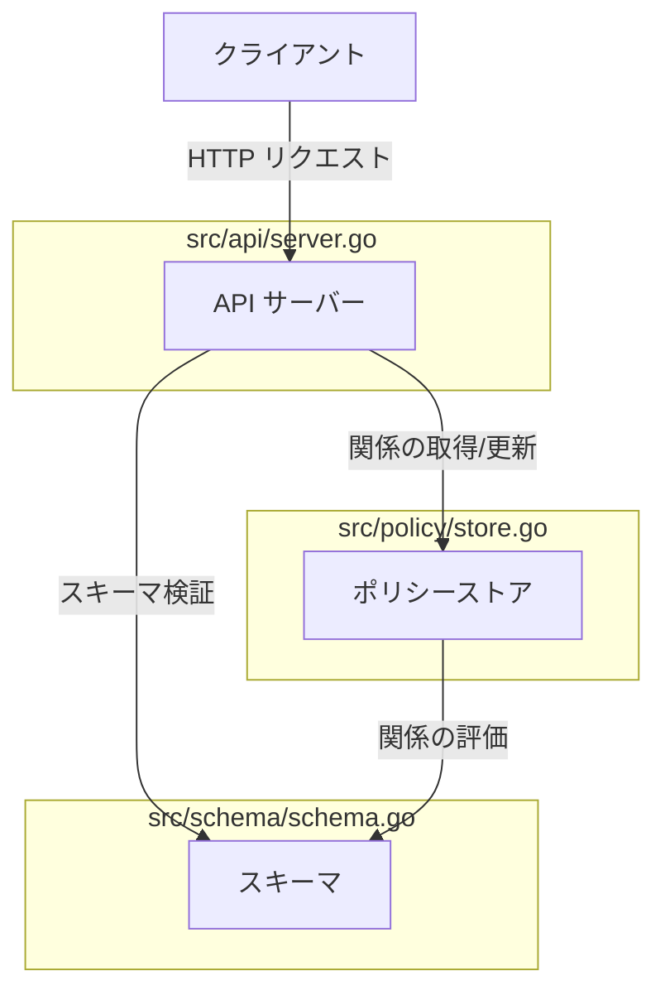
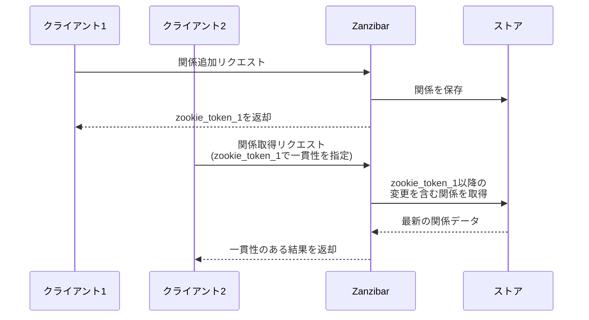
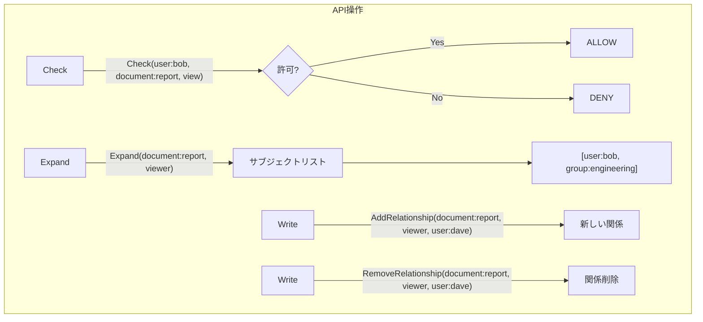
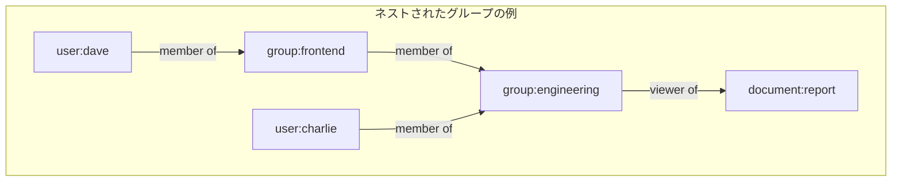
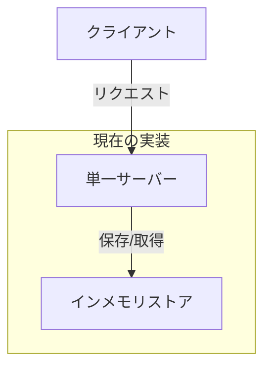
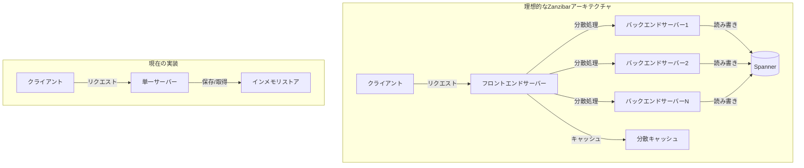

# Zanzibar sample application spec

- [Zanzibar sample application spec](#zanzibar-sample-application-spec)
  - [Zanzibar とは](#zanzibar-とは)
  - [現在の実装アーキテクチャ](#現在の実装アーキテクチャ)
  - [主要な仕様](#主要な仕様)
    - [1. 名前空間とリレーション](#1-名前空間とリレーション)
    - [2. 関係タプル（Relation Tuples）](#2-関係タプルrelation-tuples)
    - [3. 許可（パーミッション）](#3-許可パーミッション)
    - [4. 一貫性モデル](#4-一貫性モデル)
    - [5. API 操作](#5-api-操作)
    - [6. 間接的なリレーション（グループメンバーシップなど）](#6-間接的なリレーショングループメンバーシップなど)
    - [7. スケーラビリティと分散処理](#7-スケーラビリティと分散処理)
  - [理想的なアーキテクチャとの比較](#理想的なアーキテクチャとの比較)
  - [注意点](#注意点)
  - [結論](#結論)

## Zanzibar とは

Zanzibar は Google が開発した大規模分散アクセス制御システムで、Google Drive、Google Photos、YouTube などの Google サービスで使用されています。このシステムは数兆のアクセス制御関係を管理し、毎秒数百万のアクセス制御決定を処理する能力を持っています。

## 現在の実装アーキテクチャ

現在のサンプル実装のアーキテクチャは以下のようになっています：

## 主要な仕様

Zanzibar の主要な仕様と、現在の実装の適合性を以下に分析します。

### 1. 名前空間とリレーション

**仕様**: Zanzibar では、リソースは名前空間に属し、各リソースは一意のオブジェクト ID を持ちます。リレーションはリソースタイプごとに定義され、どのタイプのサブジェクトがそのリレーションに参加できるかを指定します。

**現状**: 
- `schema.go` で名前空間（リソースタイプ）とリレーションの定義を実装しています。
- リソースは `{type}:{id}` の形式で表現されています（例: `document:report`）。
- リレーションはリソースタイプごとに定義され、許可されるサブジェクトタイプを指定しています。

**適合性**: ✅ 仕様に適合しています。

### 2. 関係タプル（Relation Tuples）

**仕様**: Zanzibar では、アクセス制御関係は `{object, relation, subject}` の形式のタプルとして表現されます。

**現状**:
- `policy.Relationship` 構造体で `{Resource, Relation, Subject}` の形式でタプルを表現しています。
- タプルの形式は Zanzibar の仕様に従っています。

**適合性**: ✅ 仕様に適合しています。

### 3. 許可（パーミッション）

**仕様**: Zanzibar では、許可はリレーションの論理式として定義されます（例: `view = owner | editor | viewer`）。

**現状**:
- `schema.Definition` 構造体の `Permissions` フィールドで許可を定義しています。
- 許可は `owner | editor | viewer` のような論理式として表現されています。
- `EvaluatePermission` メソッドで論理式を評価しています。

**適合性**: ✅ 仕様に適合しています。

### 4. 一貫性モデル

**仕様**: Zanzibar は「最終的には一貫性のある」モデルを採用し、zookie と呼ばれるトークンを使用して一貫性を保証します。

**現状**:
- `ZookieToken` フィールドと `changeNumber` を使用して基本的な一貫性メカニズムを実装しています。
- しかし、分散環境での完全な一貫性保証（スナップショット分離など）は実装されていません。

**適合性**: ⚠️ 基本的な機能は実装されていますが、分散環境での完全な一貫性保証は不足しています。

### 5. API 操作

**仕様**: Zanzibar は主に以下の操作を提供します：
- Check: サブジェクトがリソースに対して特定の許可を持っているかを確認
- Expand: 特定のリソースとリレーションに対して、アクセス権を持つすべてのサブジェクトを取得
- Write: リレーションタプルの追加・削除

**現状**:
- `Check` メソッドでアクセス権の確認を実装
- `Expand` メソッドでサブジェクトの展開を実装
- `AddRelationship` と `RemoveRelationship` メソッドでタプルの追加・削除を実装

**適合性**: ✅ 仕様に適合しています。

### 6. 間接的なリレーション（グループメンバーシップなど）

**仕様**: Zanzibar は間接的なリレーション（例: グループメンバーシップを通じたアクセス権）をサポートします。

**現状**:
- `getRelations` メソッドでグループメンバーシップを通じた間接的なリレーションをサポートしています。
- 実装を改善し、ネストされたグループをサポートするようになりました。

**適合性**: ✅ ネストされたグループのサポートを追加したため、仕様に適合しています。

### 7. スケーラビリティと分散処理

**仕様**: Zanzibar は高いスケーラビリティを持ち、分散環境で動作するように設計されています。

**現状**:
- 現在の実装はインメモリストアを使用しており、分散環境での動作やスケーラビリティに制限があります。
- 本格的な分散データストア（Spanner など）の統合は実装されていません。

**適合性**: ❌ 分散環境でのスケーラビリティに関する仕様は満たしていません。

## 理想的なアーキテクチャとの比較

Googleの論文で説明されている理想的なZanzibarアーキテクチャと現在の実装を比較します。

主な違いは以下の通りです：

1. **分散アーキテクチャ**: 理想的なZanzibarは完全に分散化されていますが、現在の実装は単一サーバーです。
2. **永続ストレージ**: 理想的なZanzibarはSpannerなどの分散データベースを使用しますが、現在の実装はインメモリストアを使用しています。
3. **キャッシング**: 理想的なZanzibarは分散キャッシュを使用しますが、現在の実装にはキャッシュ層がありません。
4. **スケーラビリティ**: 理想的なZanzibarは水平スケーリングが可能ですが、現在の実装はスケーリングが制限されています。
5. **一貫性保証**: 理想的なZanzibarはスナップショット分離などの高度な一貫性メカニズムを提供しますが、現在の実装は基本的な一貫性メカニズムのみを提供しています。

## 注意点

1. **分散データストア**: 現在の実装はインメモリストアを使用しており、本番環境での使用には分散データストア（例: etcd、Spanner など）の統合が必要です。

2. **一貫性保証**: 完全な一貫性保証（特に分散環境での）は現在の実装では不足しています。本格的な実装では、スナップショット分離やその他の一貫性メカニズムが必要です。

3. **複雑な間接リレーション**: 現在の実装は基本的なグループメンバーシップをサポートしていますが、より複雑な間接リレーション（ネストされたグループ、ワイルドカード、複雑な条件など）のサポートは限定的です。

4. **パフォーマンス最適化**: キャッシング、インデックス作成、クエリ最適化などのパフォーマンス最適化は現在の実装には含まれていません。

5. **監査ログ**: Zanzibar の重要な機能である監査ログ機能は現在の実装には含まれていません。

## 結論

現在の実装は Zanzibar の基本的な概念と API を実装していますが、分散環境でのスケーラビリティ、完全な一貫性保証、高度な機能（複雑な間接リレーション、監査ログなど）については不足しています。教育目的や小規模なプロジェクトでの使用には適していますが、本格的な本番環境での使用には追加の機能実装が必要です。
