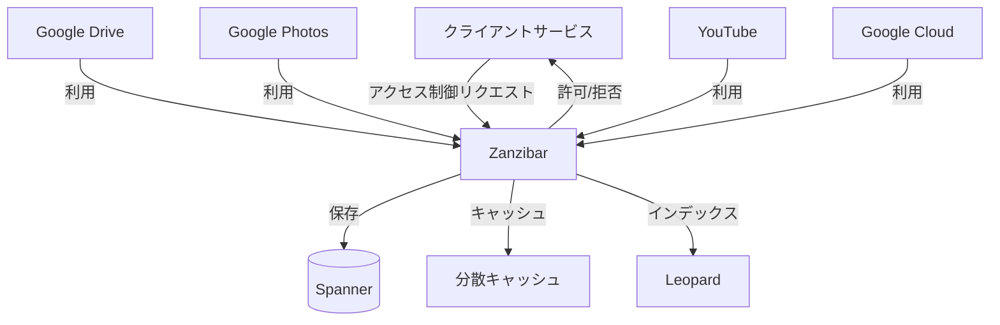
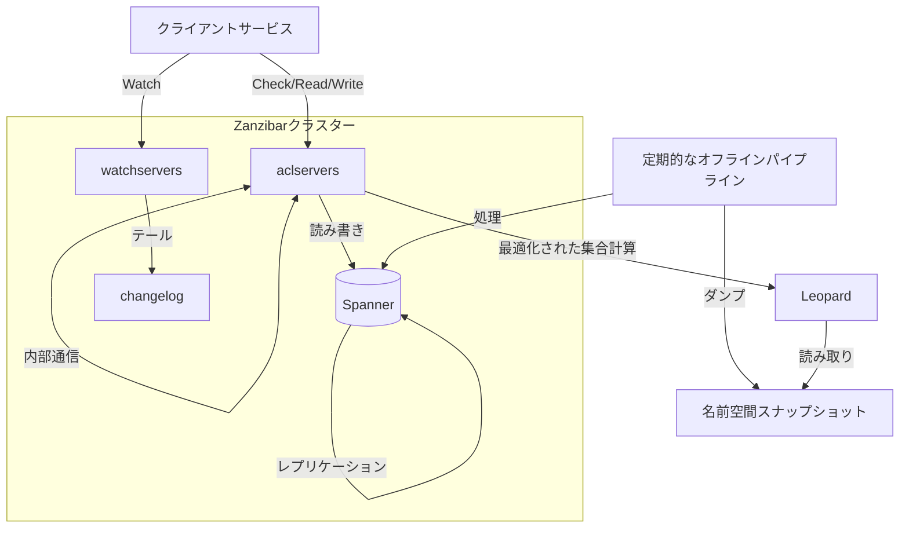
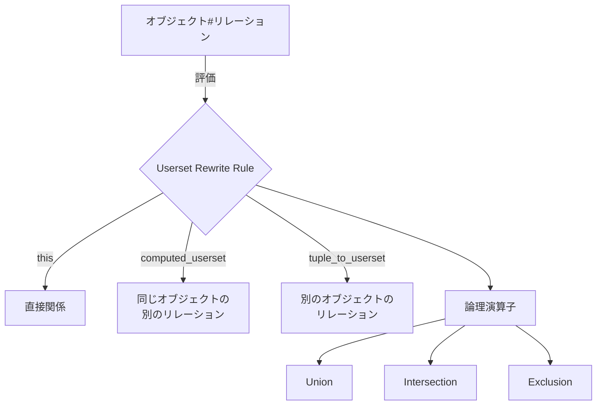

# Google Zanzibar 包括的解説

このドキュメントは、Google Zanzibar論文（https://storage.googleapis.com/gweb-research2023-media/pubtools/5068.pdf）に基づいて、Zanzibarの概念、アーキテクチャ、実装詳細を包括的に解説するものです。また、現在の実装に足りていない部分と、それらをサポートするための計画についても説明します。

## 目次

- [Google Zanzibar 包括的解説](#google-zanzibar-包括的解説)
  - [目次](#目次)
  - [1. Zanzibarの概要と背景](#1-zanzibarの概要と背景)
    - [1.1 Zanzibarとは](#11-zanzibarとは)
    - [1.2 開発背景](#12-開発背景)
    - [1.3 設計目標](#13-設計目標)
  - [2. アーキテクチャと設計原則](#2-アーキテクチャと設計原則)
    - [2.1 全体アーキテクチャ](#21-全体アーキテクチャ)
    - [2.2 主要コンポーネント](#22-主要コンポーネント)
    - [2.3 設計原則](#23-設計原則)
  - [3. データモデルと言語](#3-データモデルと言語)
    - [3.1 関係タプル（Relation Tuples）](#31-関係タプルrelation-tuples)
    - [3.2 名前空間と設定言語](#32-名前空間と設定言語)
    - [3.3 Userset Rewrite Rules](#33-userset-rewrite-rules)
  - [4. 一貫性モデル](#4-一貫性モデル)
    - [4.1 外部一貫性](#41-外部一貫性)
    - [4.2 スナップショット読み取り](#42-スナップショット読み取り)
    - [4.3 Zookieプロトコル](#43-zookieプロトコル)
    - [4.4 「新しい敵」問題の防止](#44-新しい敵問題の防止)
  - [5. API](#5-api)
    - [5.1 Check API](#51-check-api)
    - [5.2 Expand API](#52-expand-api)
    - [5.3 Read API](#53-read-api)
    - [5.4 Write API](#54-write-api)

## 1. Zanzibarの概要と背景

### 1.1 Zanzibarとは

Zanzibarは、Googleが開発した大規模分散アクセス制御システムです。Google Calendar、Google Cloud、Google Drive、Google Maps、Google Photos、YouTubeなど、Googleの多くのサービスで使用されています。Zanzibarは数兆のアクセス制御リスト（ACL）を管理し、毎秒数百万のアクセス制御決定を処理する能力を持っています。



### 1.2 開発背景

Googleの多くのサービスでは、ユーザーがデジタルオブジェクト（ドキュメント、写真、動画など）を作成し、それらを他のユーザーと共有する必要があります。これらのサービスは、数十億のユーザーと数兆のオブジェクトを扱うため、効率的で一貫性のあるアクセス制御システムが必要でした。

各サービスが独自のアクセス制御メカニズムを維持する代わりに、統一されたアクセス制御システムを構築することで、以下の利点が得られます：

1. 一貫したセマンティクスとユーザー体験
2. アプリケーション間の相互運用性の向上
3. 共通インフラストラクチャの構築（アクセス制御を尊重する検索インデックスなど）
4. エンジニアリングリソースの節約

### 1.3 設計目標

Zanzibarの設計目標は以下の通りです：

1. **正確性**: ユーザーの意図を尊重するために、アクセス制御決定の一貫性を確保する
2. **柔軟性**: 消費者向けアプリケーションとエンタープライズアプリケーションの両方に必要な、豊富なアクセス制御ポリシーのセットをサポートする
3. **低レイテンシ**: ユーザーインタラクションのクリティカルパスにあるため、迅速に応答する（特に検索結果など、多数のチェックが必要な場合のテールレイテンシが重要）
4. **高可用性**: 明示的な許可がない場合、クライアントサービスはユーザーのアクセスを拒否する必要があるため、信頼性の高い応答を提供する
5. **大規模**: 数十億のユーザーによって共有される数十億のオブジェクトを保護し、グローバルに展開する

## 2. アーキテクチャと設計原則

### 2.1 全体アーキテクチャ

Zanzibarは、グローバルに分散したシステムとして設計されています。主要なコンポーネントは以下の通りです：



Zanzibarのデータは、数十の地理的に分散したデータセンターに複製され、世界中に数千のサーバーが配置されています。

### 2.2 主要コンポーネント

1. **aclservers**: Check、Read、Expand、Writeリクエストに応答する主要なサーバータイプ
2. **watchservers**: Watchリクエストに応答する特殊なサーバータイプ
3. **Spanner**: ACLとそのメタデータを保存するグローバルデータベースシステム
4. **changelog**: タプル更新の履歴を保存するデータベース
5. **オフラインパイプライン**: 既知のスナップショットタイムスタンプでの各名前空間の関係タプルのダンプを生成
6. **Leopard**: 大規模で深くネストされた集合の操作を最適化するためのインデックスシステム

### 2.3 設計原則

Zanzibarの設計は、以下の原則に基づいています：

1. **シンプルなデータモデル**: 関係タプルという単純な形式でACLを表現
2. **強力な設定言語**: 柔軟なアクセス制御ポリシーを定義するための言語
3. **一貫性**: 外部一貫性とスナップショット読み取りによる一貫したアクセス制御決定
4. **スケーラビリティ**: 水平スケーリングと分散処理による大規模データの処理
5. **パフォーマンス最適化**: キャッシング、ホットスポット対策、テールレイテンシ軽減などの最適化

## 3. データモデルと言語

### 3.1 関係タプル（Relation Tuples）

Zanzibarでは、ACLは「関係タプル」として表現されます。関係タプルは以下の形式を持ちます：

```
<object>#<relation>@<user>
```

ここで：
- `<object>` は `<namespace>:<object_id>` の形式
- `<user>` は `<userid>` または `<userset>` の形式
- `<userset>` は `<object>#<relation>` の形式

例：
- `document:readme#owner@10` - ユーザー10はドキュメントreadmeの所有者
- `group:eng#member@11` - ユーザー11はグループengのメンバー
- `document:readme#viewer@group:eng#member` - グループengのメンバーはドキュメントreadmeのビューア
- `document:readme#parent@folder:A#...` - ドキュメントreadmeはフォルダAの中にある

関係タプルの主キーは `<namespace>`, `<object_id>`, `<relation>`, `<user>` です。

### 3.2 名前空間と設定言語

クライアントがZanzibarに関係タプルを保存する前に、名前空間を設定する必要があります。名前空間設定は以下を指定します：

1. **リレーション**: 名前と設定を持つリレーションのセット
2. **ストレージパラメータ**: シャーディング設定やオブジェクトIDのエンコーディングなど

各リレーションは、そのリレーションに参加できるサブジェクトのタイプを指定します。

### 3.3 Userset Rewrite Rules

Userset Rewrite Rulesは、オブジェクトの実効的なACLを定義するための強力なメカニズムです。これらのルールは、リレーション間の関係やオブジェクト間の継承などを表現できます。



Userset Rewrite Rulesは、以下の基本的な演算子をサポートしています：

1. **this**: 保存された関係タプルからの直接的な関係
2. **computed_userset**: 同じオブジェクトの別のリレーションから計算されるユーザーセット
3. **tuple_to_userset**: 別のオブジェクトのリレーションから計算されるユーザーセット

これらの基本演算子は、union（和集合）、intersection（積集合）、exclusion（差集合）などの集合演算子と組み合わせることができます。

例えば、以下のような設定が可能です：

```
name: "doc"
relation { name: "owner" }
relation {
  name: "editor"
  userset_rewrite {
    union {
      child { _this {} }
      child { computed_userset { relation: "owner" } }
    } } }
relation {
  name: "viewer"
  userset_rewrite {
    union {
      child { _this {} }
      child { computed_userset { relation: "editor" } }
      child { tuple_to_userset {
        tupleset { relation: "parent" }
        computed_userset {
          object: $TUPLE_USERSET_OBJECT  # parent folder
          relation: "viewer"
        } } }
    } } }
```

この例では：
- すべてのオーナーはエディタでもある
- すべてのエディタはビューアでもある
- 親フォルダのビューアは、そのフォルダ内のドキュメントのビューアでもある

## 4. 一貫性モデル

### 4.1 外部一貫性

Zanzibarは「外部一貫性」を提供します。これは、2つの因果関係のある更新 x ≺ y に対して、割り当てられるタイムスタンプが因果関係の順序を反映することを意味します：Tx < Ty。

この外部一貫性により、ACL更新の順序を尊重し、「新しい敵」問題を防止することができます。

### 4.2 スナップショット読み取り

Zanzibarは「スナップショット読み取り」をサポートしています。これにより、特定のタイムスタンプTでのACLデータベースのスナップショット読み取りが可能になります。このスナップショット読み取りは、タイムスタンプ ≤ T のすべての更新を観測します。

スナップショット読み取りと外部一貫性を組み合わせることで、ACL更新の順序を尊重し、古いACLを新しいコンテンツに適用することを防止できます。

### 4.3 Zookieプロトコル

Zanzibarは「zookie」と呼ばれる不透明な一貫性トークンを使用して、スナップショット読み取りの鮮度を制御します。zookieは、グローバルに意味のあるタイムスタンプをエンコードしています。

Zookieプロトコルの主な特徴は以下の通りです：

1. クライアントは、コンテンツ変更時に「content-change」ACLチェックを通じてzookieをリクエストします
2. Zanzibarは現在のグローバルタイムスタンプをzookieにエンコードします
3. クライアントはzookieをコンテンツ変更と共に保存します
4. クライアントは、後続のACLチェックリクエストでこのzookieを送信します
5. Zanzibarは、zookieで指定されたタイムスタンプ以降のスナップショットでチェックを評価します

このプロトコルにより、Zanzibarは大部分のチェックを既に複製されたデータで評価でき、グローバルな同期を必要とせずに低レイテンシと高可用性を実現できます。

### 4.4 「新しい敵」問題の防止

「新しい敵」問題は、ACL更新の順序が尊重されない場合や、古いACLが新しいコンテンツに適用される場合に発生する可能性があります。例えば：

**例A: ACL更新順序の無視**
1. AliceはフォルダのACLからBobを削除します
2. AliceはCharlieに新しいドキュメントをフォルダに移動するよう依頼します（ドキュメントACLはフォルダACLから継承）
3. ACLチェックが2つのACL変更の順序を無視すると、Bobは新しいドキュメントを見ることができてしまいます

**例B: 古いACLの新しいコンテンツへの適用**
1. AliceはドキュメントのACLからBobを削除します
2. AliceはCharlieにドキュメントに新しいコンテンツを追加するよう依頼します
3. ACLチェックがBobの削除前の古いACLを使用すると、Bobは新しいコンテンツを見ることができてしまいます

Zanzibarの外部一貫性とスナップショット読み取りの組み合わせにより、これらの問題を防止できます。

## 5. API

### 5.1 Check API

Check APIは、サブジェクトがリソースに対して特定の許可を持っているかどうかを確認します。

```
Check(subject, object#relation, zookie) → boolean
```

特別なタイプのチェックリクエストとして、「content-change」チェックがあります。これは、アプリケーションのコンテンツ変更を許可するために使用され、最新のスナップショットで評価されます。

### 5.2 Expand API

Expand APIは、特定のオブジェクトとリレーションに対する実効的なユーザーセットを返します。

```
Expand(object#relation, zookie) → userset_tree
```

結果は「userset tree」として表現され、ユーザーIDやユーザーセットを指す葉ノードと、union、intersection、exclusionなどの演算子を表す中間ノードで構成されます。

### 5.3 Read API

Read APIは、関係タプルを読み取ります。

```
Read(tuplesets, zookie) → tuples
```

各「tupleset」は、関係タプルのセットのキーを指定します。単一のタプルキー、特定のオブジェクトIDのすべてのタプル、または特定のユーザーセットを持つすべてのタプルを指定できます。

### 5.4 Write API

Write APIは、関係タプルを追加または削除します。

```
Write(tuples_to_add, tuples_to_delete) → zookie
```

クライアントは、楽観的並行制御を使用して、オブジェクトに関連するすべてのタプル
