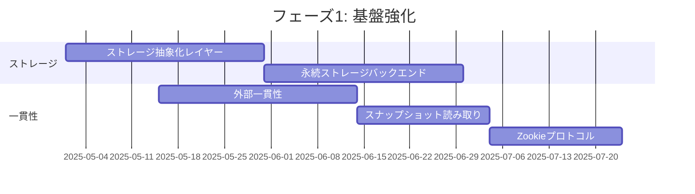
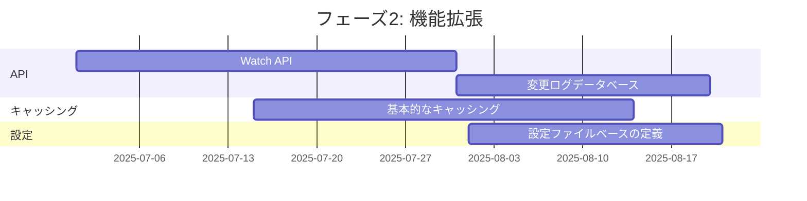
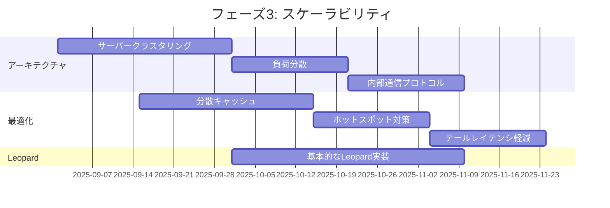
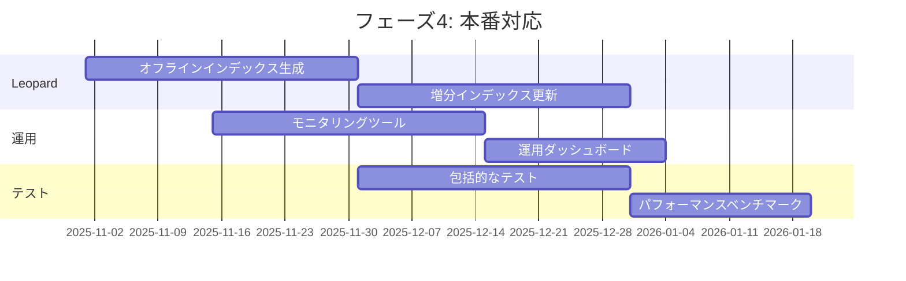

# Zanzibar 仕様強化計画

このドキュメントでは、Google Zanzibar論文（https://storage.googleapis.com/gweb-research2023-media/pubtools/5068.pdf）に基づいて、現在の実装に足りていない部分と、それらを強化するための計画を説明します。

## 目次

- [Zanzibar 仕様強化計画](#zanzibar-仕様強化計画)
  - [目次](#目次)
  - [1. 現在の実装状況](#1-現在の実装状況)
    - [1.1 実装済みの機能](#11-実装済みの機能)
    - [1.2 未実装の機能](#12-未実装の機能)
  - [2. 強化計画](#2-強化計画)
    - [2.1 フェーズ1: 基盤強化](#21-フェーズ1-基盤強化)
    - [2.2 フェーズ2: 機能拡張](#22-フェーズ2-機能拡張)
    - [2.3 フェーズ3: スケーラビリティ](#23-フェーズ3-スケーラビリティ)
    - [2.4 フェーズ4: 本番対応](#24-フェーズ4-本番対応)
  - [3. 詳細な実装計画](#3-詳細な実装計画)
    - [3.1 一貫性モデル](#31-一貫性モデル)
    - [3.2 分散アーキテクチャ](#32-分散アーキテクチャ)
    - [3.3 永続ストレージ](#33-永続ストレージ)
    - [3.4 Watch API](#34-watch-api)
    - [3.5 Leopardインデックスシステム](#35-leopardインデックスシステム)
  - [4. 優先順位と工数見積もり](#4-優先順位と工数見積もり)

## 1. 現在の実装状況

### 1.1 実装済みの機能

現在のZanzibar実装では、以下の機能が実装されています：

1. **基本的なデータモデル**:
   - 名前空間とリレーションの定義
   - 関係タプルの表現と保存
   - 基本的なアクセス制御評価

2. **Userset Rewrite Rules**:
   - `this`、`computed_userset`、`tuple_to_userset`などの基本演算子
   - union、intersection、exclusionなどの集合演算子
   - リレーション間の継承とオブジェクト間の関係の表現

3. **API**:
   - Check API: アクセス権の確認
   - Read API: 関係タプルの読み取り
   - Write API: 関係タプルの追加・削除
   - Expand API: ユーザーセットの展開

4. **グループメンバーシップ**:
   - 直接的なグループメンバーシップ
   - ネストされたグループのサポート

### 1.2 未実装の機能

Google Zanzibar論文に基づいて、現在の実装に足りていない主要な機能は以下の通りです：

1. **一貫性モデル**:
   - 完全な外部一貫性
   - スナップショット読み取りの完全な実装
   - Zookieプロトコルの完全な実装

2. **分散アーキテクチャ**:
   - 複数のデータセンターにまたがるデータレプリケーション
   - グローバルに分散したサーバークラスター
   - 分散処理とファンアウト/ファンインパターン

3. **永続ストレージ**:
   - Spannerなどの分散データベースの統合
   - 複数バージョンの関係タプルの保存
   - 変更ログデータベース

4. **Watch API**:
   - 関係タプルの変更イベントのストリーミング
   - ハートビートzookieメカニズム

5. **Leopardインデックスシステム**:
   - 効率的な集合計算のための特殊なインデックス
   - オフラインインデックス生成
   - 増分インデックス更新

6. **パフォーマンス最適化**:
   - 分散キャッシュの完全な実装
   - ホットスポット対策の強化
   - テールレイテンシ軽減の完全な実装

## 2. 強化計画

上記の未実装機能を段階的に実装するための計画を以下に示します：

### 2.1 フェーズ1: 基盤強化

1. **ストレージ抽象化レイヤーの実装**:
   - 異なるストレージバックエンドをサポートするインターフェース
   - インメモリ、リレーショナルDB、分散KVストアなどのプラグイン

2. **基本的な永続ストレージバックエンドの追加**:
   - PostgreSQL、MySQL、etcdなどの永続ストレージバックエンド
   - トランザクションサポート

3. **一貫性モデルの強化**:
   - 外部一貫性の実装
   - スナップショット読み取りの実装
   - Zookieプロトコルの実装

### 2.2 フェーズ2: 機能拡張

1. **Watch APIの実装**:
   - 変更ログデータベースの実装
   - 変更イベントのストリーミング
   - ハートビートzookieメカニズム

2. **基本的なキャッシング**:
   - 読み取りリクエストのキャッシング
   - 中間結果のキャッシング
   - キャッシュ無効化メカニズム

3. **設定ファイルベースの定義**:
   - JSONまたはYAML形式での設定サポート
   - 名前空間ごとのリレーション設定

### 2.3 フェーズ3: スケーラビリティ

1. **分散アーキテクチャの実装**:
   - サーバークラスタリング
   - リクエストの負荷分散
   - 内部通信プロトコル

2. **高度なキャッシングとパフォーマンス最適化**:
   - 分散キャッシュ
   - ホットスポット対策
   - テールレイテンシ軽減

3. **Leopardインデックスシステムの基本実装**:
   - 基本的な集合演算の効率的な実装
   - シャーディングとメモリ最適化

### 2.4 フェーズ4: 本番対応

1. **完全なLeopardインデックスシステム**:
   - オフラインインデックス生成
   - 増分インデックス更新
   - 一貫性のあるスナップショットでのクエリ評価

2. **高度なモニタリングと運用ツール**:
   - パフォーマンスモニタリング
   - アラートシステム
   - 運用ダッシュボード

3. **包括的なテストとベンチマーク**:
   - 単体テスト
   - 統合テスト
   - パフォーマンステスト
   - 負荷テスト

## 3. 詳細な実装計画

### 3.1 一貫性モデル

**外部一貫性**:
- Spannerのような外部一貫性を提供するデータベースの使用
- または、分散タイムスタンプオーダリングの実装
- 因果関係のある更新の順序を保証するメカニズム

**スナップショット読み取り**:
- マルチバージョン同時実行制御（MVCC）の実装
- タイムスタンプベースのスナップショット分離
- 読み取り時のスナップショットの指定

**Zookieプロトコル**:
- グローバルに意味のあるタイムスタンプのエンコード
- クライアントとサーバー間でのzookieの受け渡し
- zookieに基づくスナップショット読み取りの実装

### 3.2 分散アーキテクチャ

**サーバークラスタリング**:
- サーバーの役割（aclservers、watchservers）の定義
- クラスター内の通信プロトコル
- サーバーの追加・削除のサポート

**データレプリケーション**:
- 複数のデータセンターにまたがるデータの複製
- レプリケーション遅延の管理
- 一貫性レベルの設定

**リクエスト処理**:
- ファンアウト/ファンインパターンの実装
- リクエストのルーティングと負荷分散
- タイムアウトとリトライの管理

### 3.3 永続ストレージ

**ストレージ抽象化**:
- 共通インターフェースの定義
- 異なるストレージバックエンドのプラグイン
- トランザクションのサポート

**関係タプルストレージ**:
- 効率的なデータモデル
- インデックス設計
- シャーディング戦略

**変更ログ**:
- 変更イベントの記録
- イベントの順序付け
- イベントの保持ポリシー

### 3.4 Watch API

**変更イベントのストリーミング**:
- 長時間接続の管理
- イベントのバッチ処理
- クライアント切断時の状態管理

**ハートビートメカニズム**:
- 定期的なハートビートの送信
- 接続状態の監視
- 再接続のサポート

**フィルタリング**:
- 名前空間ごとのフィルタリング
- リソースタイプごとのフィルタリング
- カスタムフィルタの実装

### 3.5 Leopardインデックスシステム

**基本設計**:
- GROUP2GROUP、MEMBER2GROUPインデックスの実装
- 効率的な集合演算のサポート
- メモリ使用量の最適化

**インデックス生成**:
- オフラインインデックスビルダーの実装
- 定期的なインデックス再構築
- インデックス生成の並列化

**増分更新**:
- リアルタイムレイヤーの実装
- 変更イベントに基づくインデックス更新
- 一貫性のあるインデックス状態の維持

## 4. 優先順位と工数見積もり

以下の表は、各機能の優先順位と工数見積もりを示しています：

| 機能 | 優先順位 | 工数見積もり | 理由 |
|------|----------|--------------|------|
| ストレージ抽象化レイヤー | 高 | 4週間 | 他の機能の基盤となるため |
| 永続ストレージバックエンド | 高 | 4週間 | データの永続化に必要 |
| 外部一貫性 | 高 | 6週間 | 正確なアクセス制御に不可欠 |
| スナップショット読み取り | 高 | 4週間 | 一貫性のある読み取りに必要 |
| Zookieプロトコル | 中 | 3週間 | クライアント-サーバー間の一貫性に必要 |
| Watch API | 中 | 6週間 | リアルタイム更新に有用 |
| 変更ログデータベース | 中 | 3週間 | Watch APIの基盤 |
| 基本的なキャッシング | 中 | 4週間 | パフォーマンス向上に必要 |
| 設定ファイルベースの定義 | 低 | 2週間 | 使いやすさの向上 |
| 分散アーキテクチャ | 中 | 8週間 | スケーラビリティに必要 |
| 高度なキャッシング | 低 | 6週間 | 高負荷環境で有用 |
| Leopardインデックスシステム | 低 | 10週間 | 大規模グループに必要 |
| モニタリングと運用ツール | 低 | 6週間 | 本番環境での運用に必要 |
| 包括的なテスト | 中 | 8週間 | 信頼性の確保に必要 |

この計画に基づいて、段階的に機能を実装していくことで、Google Zanzibar論文で説明されている機能を持つ完全なアクセス制御システムを構築することができます。
