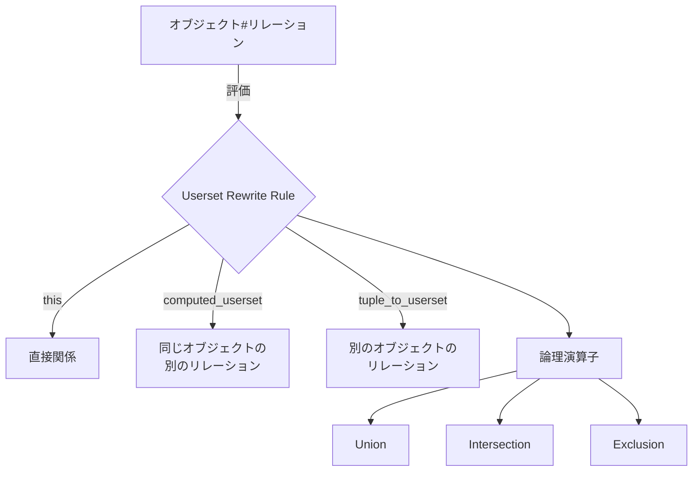

# Zanzibar Userset Rewrite Rules

このドキュメントでは、Google Zanzibar論文で説明されているUserset Rewrite Rulesの実装について説明します。

## 概要

Userset Rewrite Rulesは、Zanzibarの強力な機能の一つで、オブジェクト間の関係を柔軟に定義し、アクセス制御ポリシーを表現するための仕組みです。これにより、複雑なアクセス制御ルールを簡潔かつ効率的に表現できます。



## 実装されたルールタイプ

1. **this**: 直接的な関係を表します。
   - 例: `user:alice`は`document:report`の`owner`である

2. **computed_userset**: 同じオブジェクトの別のリレーションを参照します。
   - 例: すべての`owner`は`editor`でもある
   - 例: すべての`editor`は`viewer`でもある

3. **tuple_to_userset**: 別のオブジェクトのリレーションを参照します。
   - 例: `document:report`は`folder:projects`の中にある
   - 例: `user:eve`は`folder:projects`の`viewer`である
   - 例: したがって、`user:eve`は`document:report`の`viewer`でもある

4. **union**: 複数のルールのいずれかが一致する場合に適用されます。
   - 例: `viewer = this | editor | parent#viewer`

5. **intersection**: 複数のルールのすべてが一致する場合に適用されます。
   - 例: `admin = owner & member`

6. **exclusion**: ベースからサブトラクトを引いた結果を表します。
   - 例: `collaborator = viewer - blocked`

## 実装の詳細

### スキーマ定義

`schema/userset_rewrite.go`ファイルでは、Userset Rewrite Rulesの基本構造と操作を定義しています。主な構造体は以下の通りです：

```go
// UsersetRewrite defines a rule for computing a userset
type UsersetRewrite struct {
    Type            UsersetRewriteType `json:"type"`
    ComputedUserset *ComputedUserset   `json:"computed_userset,omitempty"`
    TupleToUserset  *TupleToUserset    `json:"tuple_to_userset,omitempty"`
    Children        []*UsersetRewrite  `json:"children,omitempty"`
}
```

### リレーション定義の拡張

`schema/schema.go`ファイルでは、`Relation`構造体に`UsersetRewrite`フィールドを追加して、リレーションごとにリライトルールを定義できるようにしています：

```go
// Relation defines a relationship between resources
type Relation struct {
    Subjects       []Subject       `json:"subjects"`
    UsersetRewrite *UsersetRewrite `json:"userset_rewrite,omitempty"`
}
```

### ルール評価

`policy/evaluator.go`ファイルでは、Userset Rewrite Rulesを評価するための`Evaluator`を実装しています。これにより、複雑なアクセス制御ルールを効率的に評価できます。

## サンプル実装

このリポジトリには、以下のUserset Rewrite Rulesのサンプル実装が含まれています：

1. **ドキュメントのビューア権限**:
   ```
   viewer = this | editor | parent#viewer
   ```
   - 直接ビューアとして指定されたユーザー
   - エディタ権限を持つユーザー
   - 親フォルダのビューア権限を持つユーザー

2. **ドキュメントのエディタ権限**:
   ```
   editor = this | owner
   ```
   - 直接エディタとして指定されたユーザー
   - オーナー権限を持つユーザー

## テスト実行方法

Userset Rewrite Rulesの機能をテストするには、以下のコマンドを実行します：

```bash
./tests/test-userset-rewrite.sh
```

このスクリプトは、以下のテストケースを実行します：

1. 直接オーナーがドキュメントを閲覧できる
2. 直接エディタがドキュメントを閲覧できる
3. 直接グループメンバーがドキュメントを閲覧できる
4. ネストされたグループメンバーがドキュメントを閲覧できる
5. 親フォルダのビューアがドキュメントを閲覧できる（tuple_to_userset）
6. 未知のユーザーはドキュメントを閲覧できない
7. オーナーはドキュメントを編集できる
8. エディタはドキュメントを編集できる
9. ビューアはドキュメントを編集できない
10. オーナーのみがドキュメントを削除できる
11. エディタはドキュメントを削除できない

## Google Zanzibar論文との関連

この実装は、Google Zanzibar論文（https://storage.googleapis.com/gweb-research2023-media/pubtools/5068.pdf）の2.3.1節で説明されているUserset Rewrite Rulesに基づいています。論文では、以下のような例が示されています：

```
name: "doc"
relation { name: "owner" }
relation {
  name: "editor"
  userset_rewrite {
    union {
      child { _this {} }
      child { computed_userset { relation: "owner" } }
    } } }
relation {
  name: "viewer"
  userset_rewrite {
    union {
      child { _this {} }
      child { computed_userset { relation: "editor" } }
      child { tuple_to_userset {
        tupleset { relation: "parent" }
        computed_userset {
          object: $TUPLE_USERSET_OBJECT  # parent folder
          relation: "viewer"
        } } }
    } } }
```

この例では、すべてのオーナーはエディタであり、すべてのエディタはビューアであり、親フォルダのビューアはドキュメントのビューアでもあるという関係を定義しています。

## 今後の拡張

1. **より複雑なルールのサポート**: 現在の実装は基本的なルールタイプをサポートしていますが、より複雑なルールや条件付きルールのサポートを追加できます。

2. **パフォーマンス最適化**: ルール評価のキャッシングや最適化を実装して、パフォーマンスを向上させることができます。

3. **設定ファイルベースの定義**: JSONやYAML形式の設定ファイルからUserset Rewrite Rulesを読み込む機能を追加できます。
